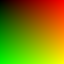

# App-01: CPU-Rendering

# Description
This repo will serve as an exploration into writing a rendering engine, along with some image processing topics

# TODO:
- [X] Get the .bmp writer working
    - 
- [ ] Fully Document what each entry in the file writer is doing
- [ ] Work on "Hello-Triangle"

# Notes:

1 Pixel = 3 Bytes (1 byte for r,g,b)

So for a 3x2 image (2 rows with 3 pixels each), each row takes up 3 (# of pixels) * 3 (Bytes per pixel) = 9 Bytes

But each row needs align to a 4 byte boundary. So we add 1 byte for padding
